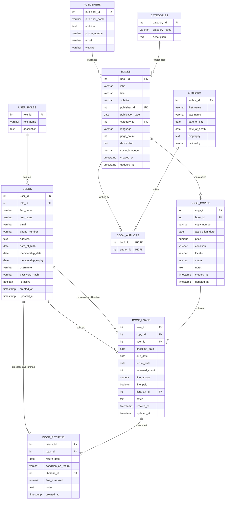

# Library Database Entity Relationship Diagram

## Database Schema Overview

This Entity Relationship Diagram (ERD) represents the Library Management System database structure. The database is designed to manage all aspects of a library, including:

1. **User Management**
   - User accounts with roles (librarian, member)
   - Membership tracking

2. **Book Catalog**
   - Books with detailed metadata
   - Authors and publishers information
   - Categories/genres

3. **Inventory Management**
   - Individual book copies with condition and location
   - Acquisition tracking

4. **Circulation**
   - Book loans and returns
   - Due date tracking
   - Fine assessment

### Key Relationships

- Books can have multiple authors (many-to-many relationship through BOOK_AUTHORS)
- Each book can have multiple physical copies (one-to-many)
- Users can check out book copies (one-to-many)
- Librarians (who are also users) can process loans and returns
- Books belong to categories and publishers (many-to-one)

This schema supports all essential library operations including cataloging, circulation, and user management.
