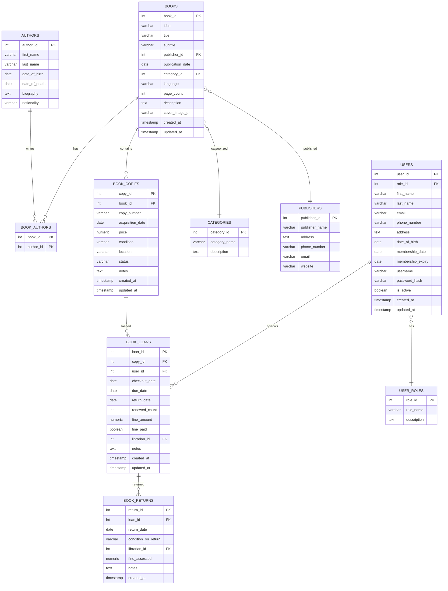

# Entity Relationship Diagram

```mermaid
erDiagram
  AUTHORS {
    int author_id PK
    varchar first_name
    varchar last_name
    date date_of_birth
    date date_of_death
    text biography
    varchar nationality
  }
  BOOK_AUTHORS {
    int book_id PK
    int author_id PK
  }
  BOOK_COPIES {
    int copy_id PK
    int book_id FK
    varchar copy_number
    date acquisition_date
    numeric price
    varchar condition
    varchar location
    varchar status
    text notes
    timestamp created_at
    timestamp updated_at
  }
  BOOK_LOANS {
    int loan_id PK
    int copy_id FK
    int user_id FK
    date checkout_date
    date due_date
    date return_date
    int renewed_count
    numeric fine_amount
    boolean fine_paid
    int librarian_id FK
    text notes
    timestamp created_at
    timestamp updated_at
  }
  BOOK_RETURNS {
    int return_id PK
    int loan_id FK
    date return_date
    varchar condition_on_return
    int librarian_id FK
    numeric fine_assessed
    text notes
    timestamp created_at
  }
  BOOKS {
    int book_id PK
    varchar isbn
    varchar title
    varchar subtitle
    int publisher_id FK
    date publication_date
    int category_id FK
    varchar language
    int page_count
    text description
    varchar cover_image_url
    timestamp created_at
    timestamp updated_at
  }
  CATEGORIES {
    int category_id PK
    varchar category_name
    text description
  }
  PUBLISHERS {
    int publisher_id PK
    varchar publisher_name
    text address
    varchar phone_number
    varchar email
    varchar website
  }
  USER_ROLES {
    int role_id PK
    varchar role_name
    text description
  }
  USERS {
    int user_id PK
    int role_id FK
    varchar first_name
    varchar last_name
    varchar email
    varchar phone_number
    text address
    date date_of_birth
    date membership_date
    date membership_expiry
    varchar username
    varchar password_hash
    boolean is_active
    timestamp created_at
    timestamp updated_at
  }

  AUTHORS ||--o{ BOOK_AUTHORS : writes
  BOOKS ||--o{ BOOK_AUTHORS : has
  BOOKS ||--o{ BOOK_COPIES : contains
  BOOK_COPIES ||--o{ BOOK_LOANS : loaned
  USERS ||--o{ BOOK_LOANS : borrows
  BOOK_LOANS ||--o{ BOOK_RETURNS : returned
  BOOKS }o--|| CATEGORIES : categorized
  BOOKS }o--|| PUBLISHERS : published
  USERS }o--|| USER_ROLES : has
```
